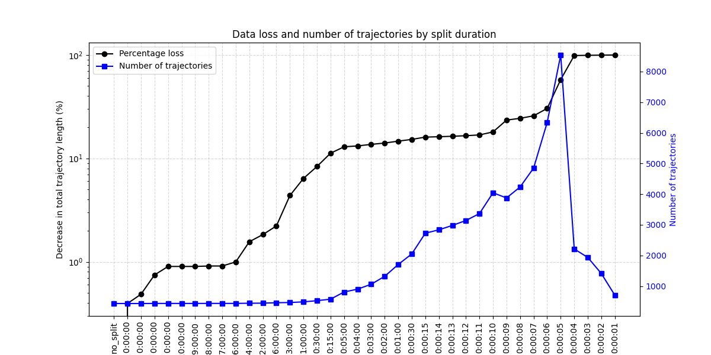

<!-- markdownlint-disable -->

# Job+ GPS trajectory data documentation

## 1. Introduction
This document describes the data cleaning procedures applied to the dataset utilized in this project. The objective of these procedures is to ensure data integrity, consistency, and readiness for subsequent analysis.

- **Dataset Source:** logged positions from Job+  
- **Dataset Description:** The data consists of an id('id_'), a timestamp('recordedAt), a device id('deviceId'), the name of the event('event'), an odometer reading from the device('odometer'), and the location('geometry') in latitude and longitude format (wsg:4326). The data consists of 1.149.770 records and spans from 2025-01-01 01:12 to 2025-06-25 13:19. 

<p align="center">

| _id                      | recordedAt                 | deviceId   | event       |   odometer | geometry                                      |
|:-------------------------|:---------------------------|:-----------|:------------|-----------:|:----------------------------------------------|
| `67749673ed570034f7de0ea6` | `2025-01-01 01:12:19.366000` | `KENKÄP-11`  | `reg_started` |        `nan` | `POINT (12.720614186494425 56.140193107260515)` |

</p>

- **Purpose of Cleaning:** To create consistent trajectories, handle time duplicates  within trajectories, document behavior of libraries used and determine a suitable threshold when splitting trajectories by a timegap between obersvations.

---

## 2. Objectives
The data cleaning process was designed to achieve the following objectives:  

1. Documenting format of raw data 
2. Ensure consistent assigning of trajectory_ids based on events such as 'reg_started', 'reg_completed', and 'reg_postponed'.  
3. Specify geographical format of coordinates.  
4. Document selection of relevant thresholds when splitting trajectories based on observationgap.  
5. Document behavior of movingpandas when handling time duplicates and how we prioritize events when dropping duplicates.

---

## 3. Methodology

### 3.1 Data Cleaning Steps
The data cleaning pipeline follows a sequential set of procedures as outlined below:

| Step | Description | Justification | Implementation Reference |
|------|-------------|---------------|--------------------------|
| 1 | Checking consistency of the variables used for analysis: ['device_id', 'recordedAt', 'odometer', 'location'] | Documenting format of raw data | 'script_XX point XX' |
| 2 | Reading JSON to df, selecting relevant columns, and discarding coordinates of (0,0) as an error | Reading relevant data for analysis | 'script_XX point XX' |
| 3 | Defining trajectory_id algorithm | Each trajectory is uniquely and consistently identified | 'script_XX point XX' |
| 4 | We document that movingpandas drops points at identical timestamps within trajectories | Document behavior of used libraries | 'script_XX point XX' |
| 5 | We document that time duplicates within trajectories have identical coordiantes| Allows for prioritizing among events between duplicates | 'script_XX point XX' |
| 6 | We prioritize events ("reg_started", "reg_postpone", "reg_complete", "position") among timeduplicates within trajectories | Keeping the event type that provides most information about the trajectory | 'script_XX point XX' |
| 7 | Generate plots of duplicates without a prioritized event, and confirm that they fall within a trajectory | Document that the points contain valuable information and are not considered erroneous| 'script_XX point XX' |
| 8 | We split trajectories when a selected timegap between observations occur. We repeat the splitting at different observationgaps ranging from 4 days to 1 second | Allows us to calculate how much data is "lost" at each split | 'script_XX point XX' |
| 9 | We plot the total length of trajectories as a function of observationgap threshold when splitting. | We aim to identify a threshold that balances data continuity with accurate segmentation and limited loss of data. | 'script_XX point XX' |


---

### 3.2 Assumptions and definitions

Data (Assumption):
- Records with latitude and longitude = 0  are treated as erroneous and dropped.  

Trajectory ID's (Definitions):
- A new trajectory will allways be made if reg_started event occurs.
- A trajectory will always be terminated if reg_complete or reg_postpone occurs.
- Segments after a reg_complete or reg_postpone wll be their own segments as well.


---

## 4. Illustrative Examples


### Step 3. Printing results of assigment of trajectoryID's based on our trajectory definitons in 3.2

Below we illustrate a slice of output from the function assign_trajectory_ids in script_XX part_XX. We confirm that the definitions of start and end from 3.2 are met, and that all trajectory_id's are assigned as intended. 

| trajectory_start_time |  trajectory_end_time | device_id_start  | devide_id_end | id_increment | trajectory_id | first_and_last_events_in_route|
|-----|-----|-----|-----|-----|-----|-----|
|2025-06-24 08:54:17| 2025-06-24 09:42:55| NIMARE-11| NIMARE-11| ID increase: 1| 006133|reg_started to reg_complete| 
|2025-06-24 09:43:31| 2025-06-24 10:07:55| NIMARE-11| NIMARE-11| ID increase: 1| 006134|position to service_stop| 
|2025-06-24 10:08:38| 2025-06-24 10:12:25| NIMARE-11| NIMARE-11| ID increase: 1| 006135|reg_started to reg_complete| 
|2025-06-24 10:15:47| 2025-06-24 15:47:14| NIMARE-11| NIMARE-11| ID increase: 1| 006136|position to position| 
|2025-01-29 10:58:20| 2025-02-25 13:20:40| ROBFÄR-11| ROBFÄR-11| ID increase: 1| 006137|position to position| 
|2025-02-25 13:20:51| 2025-02-26 13:13:58| ROBFÄR-11| ROBFÄR-11| ID increase: 1| 006138|reg_started to reg_complete| 
|2025-02-26 13:14:04| 2025-03-18 15:26:24| ROBFÄR-11| ROBFÄR-11| ID increase: 1| 006139|position to position| 
|2025-03-06 14:09:46| 2025-03-06 14:38:05| ROBHEN-11| ROBHEN-11| ID increase: 1| 006140|service_stop to pos_sending_stop| 
|2025-03-06 14:38:05| 2025-03-06 14:49:19| ROBHEN-11| ROBHEN-11| ID increase: 1| 006141|reg_started to reg_complete| 
|2025-03-06 14:49:27| 2025-04-01 12:39:54| ROBHEN-11| ROBHEN-11| ID increase: 1| 006142|position to reg_complete| 


### Step 4. Movingpandas drops points at identical timestamps

The sample data on the left has five records, but only two unique timestamps. We show that when creating a trajectory using mpdTrajectoryCollection - said trajectory will only consists of two points. Visit code: "Script_XX" part "...."  


<table>
<tr>
  <td valign="top">

| timestamp           | row_id | id | geometry                |
|--------------------|--------|----|------------------------|
| 2025-09-02 12:00:00 | 1      | 1  | POINT (12.34 56.78)   |
| 2025-09-02 12:00:00 | 2      | 1  | POINT (12.34 56.78)   |
| 2025-09-02 12:00:00 | 3      | 1  | POINT (12.34 56.78)   |
| 2025-09-02 12:00:00 | 4      | 1  | POINT (12.34 56.78)   |
| 2025-09-02 12:00:05 | 5      | 1  | POINT (12.34 56.78)   |

  </td>
  <td valign="top" style="padding-left: 40px;">

| timestamp           | row_id | id | geometry                |
|--------------------|--------|----|------------------------|
| 2025-09-02 12:00:00 | 1      | 1  | POINT (12.34 56.78)   |
| 2025-09-02 12:00:05 | 5      | 1  | POINT (12.34 56.78)   |

  </td>
</tr>
</table>


### Step 6. Prioritizing events when handling timeduplicates within trajectories.

In table XX we count all event values present in the data. We see that the number of 'reg_started' roughly corresponds to the sum of 'reg_complete' and 'reg_postpone'. 

<div style="display: flex; gap: 40px;">

<div>

| event            |   count |
|:-----------------|--------:|
| position         | 1118930 |
| pic_loc_warmup   |    6336 |
| service_stop     |    5857 |
| service_reset    |    5205 |
| reg_started      |    3799 |
|                  |    ...  |


</div>

<div>

| ...                 |         |
|:-----------------|--------:|
| pos_sending_stop |    2499 |
| reg_complete     |    2304 |
| service_start    |    1588 |
| reg_postpone     |    1501 |
| log_in           |    1499 |
| log_out          |     252 |

</div>

</div>

In 3.1 step 5 we confirmed that there is no variation among the coordinates of timeduplicates within trajectories. Therefore we are able to select the event type that preserves as much relevant information as possible.

When handling timeduplicates within trjaectories we prioritize events as follows:

1) 'reg_started'
2) 'reg_complete'
3) 'reg_postpone'
4) 'position'
5) others

Below we illustrate a slice of output from the function keep_prioritized_duplicates() in script_XX part_XX, to document that within each group of duplicates, only the highest ranking event in our hierachy of prioritized events is kept. 


```text
GROUP NUMBER 9015
['reg_started' 'pos_sending_stop' 'pic_loc_warmup' 'service_stop' 'service_reset']
HERE IS REG_STARTED
Events to drop [['pos_sending_stop', ObjectId('685be84f466addcbfb2aa980')], 
                ['pic_loc_warmup', ObjectId('685be850145e1fdf382d2e8d')], 
                ['service_stop', ObjectId('685be8506f6eef21575661a1')], 
                ['service_reset', ObjectId('685be850466addcbfb2aa988')]]
IDS to drop [[ObjectId('685be84f466addcbfb2aa980')], 
             [ObjectId('685be850145e1fdf382d2e8d')], 
             [ObjectId('685be8506f6eef21575661a1')], 
             [ObjectId('685be850466addcbfb2aa988')]]

GROUP NUMBER 9016
['position' 'pic_loc_warmup']
HERE IS A POSITION
Events to drop [['pic_loc_warmup', ObjectId('685bea63466addcbfb2ac62f')]]
IDS to drop [[ObjectId('685bea63466addcbfb2ac62f')]]

GROUP NUMBER 9017
['position' 'reg_postpone']
HERE IS REG_POSTPONE
Events to drop [['position', ObjectId('685bea6c466addcbfb2ac69c')]]
IDS to drop [[ObjectId('685bea6c466addcbfb2ac69c')]]

GROUP NUMBER 9018
['position' 'service_reset' 'service_stop']
HERE IS A POSITION
Events to drop [['service_reset', ObjectId('67bc94ad9ff0cf019754b94f')], 
                ['service_stop', ObjectId('67bc9995b8df0828bc3dcd61')]]
IDS to drop [[ObjectId('67bc94ad9ff0cf019754b94f')], 
             [ObjectId('67bc9995b8df0828bc3dcd61')]]
```

### Step 9. Visualizing trajectory length loss as a function of observationgap.




## 5. Reproducibility
### 5.1 Scripts and Notebooks
| File | Purpose |
|------|---------|
| `script_XX` | Preprocessing script |


### 5.2 Dependencies
The cleaning workflow requires the following packages:

Preliminary answer....

Environment: (python-samples-monorepo)

Packages:

|Package                     | Version  |   Editable project location|
|---------------------------- |----------- |------------------------------------------------------------------------------------|
|altair                       |5.5.0       |                                                                                    |
|annotated-types              |0.7.0       |                                                                                    |
|anyio                        |4.9.0       |                                                                                    |
|apscheduler                  |3.11.0      |                                                                                    |
|asgi-correlation-id          |4.3.4       |                                                                                    |
|asttokens                    |3.0.0       |                                                                                    |
|attrs                        |25.3.0      |                                                                                    |
|beanie                       |1.30.0      |                                                                                    |
|beautifulsoup4               |4.13.5      |                                                                                    |
|bleach                       |6.2.0       |                                                                                    |
|blinker                      |1.9.0       |                                                                                    |
|bokeh                        |3.7.3       |                                                                                    |
|branca                       |0.8.1       |                                                                                    |
|cachetools                   |6.1.0       |                                                                                    |
|cartopy                      |0.24.1      |                                                                                    |
|certifi                      |2025.6.15   |                                                                                    |
|cfgv                         |3.4.0       |                                                                                    |
|charset-normalizer           |3.4.2       |                                                                                    |
|click                        |8.2.1       |                                                                                    |
|click-plugins                |1.1.1.2     |                                                                                    |
|cligj                        |0.7.2       |                                                                                    |
|colorcet                     |3.1.0       |                                                                                    |
|comm                         |0.2.2       |                                                                                    |
|contourpy                    |1.3.2       |                                                                                    |
|coverage                     |7.9.1       |                                                                                    |
|cuid2                        |2.0.1       |                                                                                    |
|cycler                       |0.12.1      |                                                                                    |
|debugpy                      |1.8.14      |                                                                                    |
|decorator                    |5.2.1       |                                                                                    |
|defusedxml                   |0.7.1       |                                                                                    |
|distlib                      |0.3.9       |                                                                                    |
|dnspython                    |2.7.0       |                                                                                    |
|email-validator              |2.2.0       |                                                                                    |
|executing                    |2.2.0       |                                                                                    |
|fastapi                      |0.115.14    |                                                                                    |
|fastapi-cli                  |0.0.7       |                                                                                    |
|fastapi-pagination           |0.13.3      |                                                                                    |
|fastapi-problem              |0.11.4      |                                                                                    |
|fastjsonschema               |2.21.2      |                                                                                    |
|filelock                     |3.18.0      |                                                                                    |
|fiona                        |1.10.1      |                                                                                    |
|folium                       |0.20.0      |                                                                                    |
|fonttools                    |4.58.4      |                                                                                    |
|geographiclib                |2.0         |                                                                                    |
|geopandas                    |1.1.1       |                                                                                    |   
|geopy                        |2.4.1       |                                                                                    |    
|geoviews                     |1.14.0      |                                                                                    |   
|gitdb                        |4.0.12      |                                                                                    |   
|gitpython                    |3.1.45      |                                                                                    |   
|greenlet                     |3.2.3       |                                                                                    |   
|h11                          |0.16.0      |                                                                                    |    
|h3                           |4.3.0       |                                                                                    |  
|holoviews                    |1.21.0      |                                                                                    |   
|httpcore                     |1.0.9       |                                                                                    |   
|httptools                    |0.6.4       |                                                                                    |   
|httpx                        |0.28.1      |                                                                                    |    
|hvplot                       |0.11.3      |                                                                                    |   
|identify                     |2.6.12      |                                                                                    |    
|idna                         |3.10        |                                                                                    |   
|iniconfig                    |2.1.0       |                                                                                    |   
|ipykernel                    |6.29.5      |                                                                                    |   
|ipython                      |9.3.0       |                                                                                    |   
|ipython-pygments-lexers      |1.1.1       |                                                                                    |  
|ipywidgets                   |8.1.7       |                                                                                    |   
|itsdangerous                 |2.2.0       |                                                                                    |  
|jedi                         |0.19.2      |                                                                                    |   
|jinja2                       |3.1.6       |                                                                                    |  
|joblib                       |1.5.1       |                                                                                    |  
|jsonschema                   |4.25.1      |                                                                                    |   
|jsonschema-specifications    |2025.4.1    |                                                                                    |
|jupyter-client               |8.6.3       |                                                                                    |
|jupyter-core                 |5.8.1       |                                                                                    |
|jupyter-leaflet              |0.20.0      |                                                                                    |
|jupyterlab-pygments          |0.3.0       |                                                                                    |
|jupyterlab-widgets           |3.0.15      |                                                                                    | 
|kiwisolver                   |1.4.8       |                                                                                    |
|lazy-model                   |0.2.0       |                                                                                    | 
|linkify-it-py                |2.0.3       |                                                                                    |
|mapclassify                  |2.9.0       |                                                                                    |
|markdown                     |3.8.2       |                                                                                    |
|markdown-it-py               |3.0.0       |                                                                                    |
|markupsafe                   |3.0.2       |                                                                                    |
|matplotlib                   |3.10.3      |                                                                                    |
|matplotlib-inline            |0.1.7       |                                                                                    |
|mdit-py-plugins              |0.4.2       |                                                                                    |
|mdurl                        |0.1.2       |                                                                                    |
|mistune                      |3.1.3       |                                                                                    |
|motor                        |3.7.1       |                                                                                    |     
|movingpandas                 |0.22.3      |                                                                                    |
|multidict                    |6.0.5       |                                                                                    |
|mypy                         |1.16.1      |                                                                                    |
|mypy-extensions              |1.1.0       |                                                                                    |
|narwhals                     |1.45.0      |                                                                                    |
|nbclient                     |0.10.2      |                                                                                    |
|nbconvert                    |7.16.6      |                                                                                    |
|nbformat                     |5.10.4      |                                                                                    |
|nest-asyncio                 |1.6.0       |                                                                                    |
|networkx                     |3.5         |                                                                                    |
|nodeenv                      |1.9.1       |                                                                                    |
|numpy                        |2.3.1       |                                                                                    |
|nvidia-ml-py                 |12.575.51   |                                                                                    |
|orjson                       |3.10.18     |                                                                                    |
|packaging                    |25.0        |                                                                                    |
|pandas                       |2.3.0       |                                                                                    |
|pandocfilters                |1.5.1       |                                                                                    |
|panel                        |1.7.2       |                                                                                    |
|param                        |2.2.1       |                                                                                    |
|parso                        |0.8.4       |                                                                                    |
|pathspec                     |0.12.1      |                                                                                    |
|pexpect                      |4.9.0       |                                                                                    |
|pillow                       |11.3.0      |                                                                                    |
|platformdirs                 |4.3.8       |                                                                                    |
|plotly                       |6.3.0       |                                                                                    |
|pluggy                       |1.6.0       |                                                                                    |
|pre-commit                   |4.2.0       |                                                                                    |
|prompt-toolkit               |3.0.51      |                                                                                    |
|protobuf                     |6.32.0      |                                                                                    |
|psutil                       |7.0.0       |                                                                                    |
|ptyprocess                   |0.7.0       |                                                                                    |
|pure-eval                    |0.2.3       |                                                                                    |
|pyarrow                      |21.0.0      |                                                                                    |
|pydantic                     |2.11.7      |                                                                                    |
|pydantic-core                |2.33.2      |                                                                                    |
|pydantic-extra-types         |2.10.5      |                                                                                    |
|pydantic-settings            |2.10.1      |                                                                                    |
|pydeck                       |0.9.1       |                                                                                    | 
|pygments                     |2.19.2      |                                                                                    |
|pyjwt                        |2.10.1      |                                                                                    |
|pymongo                      |4.13.2      |                                                                                    |
|pynvml                       |12.0.0      |                                                                                    |
|pyogrio                      |0.11.0      |                                                                                    |
|pyparsing                    |3.2.3       |                                                                                    |
|pyproj                       |3.7.1       |                                                                                    |
|pyshp                        |2.3.1       |                                                                                    |
|pytest                       |8.4.1       |                                                                                    |
|pytest-asyncio               |1.0.0       |                                                                                    |
|pytest-cov                   |6.2.1       |                                                                                    |
|pytest-mock                  |3.14.1      |                                                                                    |
|python-dateutil              |2.9.0.post0 |                                                                                    |
|python-dotenv                |1.1.1       |                                                                                    |
|python-json-logger           |3.3.0       |                                                                                    |
|python-multipart             |0.0.20      |                                                                                    |
|pytz                         |2025.2      |                                                                                    |
|pyviz-comms                  |3.0.6       |                                                                                    |
|pyyaml                       |6.0.2       |                                                                                    |
|pyzmq                        |27.0.0      |                                                                                    |
|referencing                  |0.36.2      |                                                                                    |
|requests                     |2.32.4      |                                                                                    |
|rfc9457                      |0.3.6       |                                                                                    |
|rich                         |14.0.0      |                                                                                    |
|rich-toolkit                 |0.14.7      |                                                                                    |
|rpds-py                      |0.27.0      |                                                                                    |
|ruff                         |0.12.1      |                                                                                    |
|sample                       |0.1.0       | /workspaces/python_samples/apps/sample                                             |
|sample-core                  |0.1.0       | /workspaces/python_samples/packages/sample_core                                    |
|scikit-learn                 |1.7         |                                                                                    |
|scipy                        |1.16.0      |                                                                                    |      
|seaborn                      |0.13.2      |                                                                                    |      
|shapely                      |2.1.1       |                                                                                    |      
|shellingham                  |1.5.4       |                                                                                    |      
|simple-storage               |0.1.0       |      /workspaces/python_samples/apps/simple_storage                                |  
|simple-worker                |0.1.0       |      /workspaces/python_samples/apps/simple_worker                                 |
|six                          |1.17.0      |                                                                                    |
|smmap                        |5.0.2       |                                                                                    |
|sniffio                      |1.3.1       |                                                                                    |
|soupsieve                    |2.7         |                                                                                    |
|sqlalchemy                   |2.0.41      |                                                                                    |
|sqlmodel                     |0.0.24      |                                                                                    |
|stack-data                   |0.6.3       |                                                                                    |
|starlette                    |0.46.2      |                                                                                    |
|starlette-problem            |0.12.3      |                                                                                    |
|streamlit                    |1.48.1      |                                                                                    |
|streamlit-cookies-controller |0.0.4       |                                                                                    |
|streamlit-dynamic-filters    |0.1.9       |                                                                                    |
|streamlit-folium             |0.25.1      |                                                                                    |
|tabulate                     |0.9.0       |                                                                                    |
|tenacity                     |9.1.2       |                                                                                    |
|threadpoolctl                |3.6.0       |                                                                                    |
|tinycss2                     |1.4.0       |                                                                                    |
|toml                         |0.10.2      |                                                                                    |
|tornado                      |6.5.1       |                                                                                    |
|tqdm                         |4.67.1      |                                                                                    |
|traitlets                    |5.14.3      |                                                                                    |
|typer                        |0.16.0      |                                                                                    |
|typing-extensions            |4.14.0      |                                                                                    |
|typing-inspection            |0.4.1       |                                                                                    |
|tzdata                       |2025.2      |                                                                                    |
|tzlocal                      |5.3.1       |                                                                                    |
|uc-micro-py                  |1.0.3       |                                                                                    |
|ujson                        |5.10.0      |                                                                                    |
|urllib3                      |2.5.0       |                                                                                    |
|utilities                    |0.1.0       |      /workspaces/python_samples/packages/utilities                                 |
|uvicorn                      |0.35.0      |                                                                                    |
|uvloop                       |0.21.0      |                                                                                    |
|virtualenv                   |20.31.2     |                                                                                    |
|watchdog                     |6.0.0       |                                                                                    |
|watchfiles                   |1.1.0       |                                                                                    |
|wcwidth                      |0.2.13      |                                                                                    |
|webencodings                 |0.5.1       |                                                                                    |
|websockets                   |15.0.1      |                                                                                    |
|widgetsnbextension           |4.0.14      |                                                                                    |
|xyzservices                  |2025.4.0    |                                                                                    |